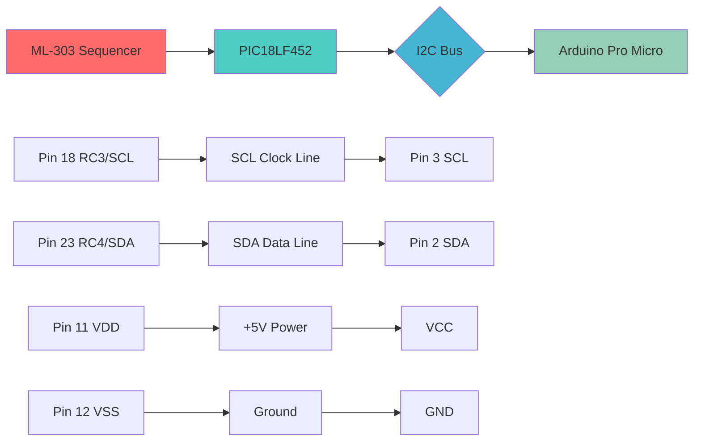
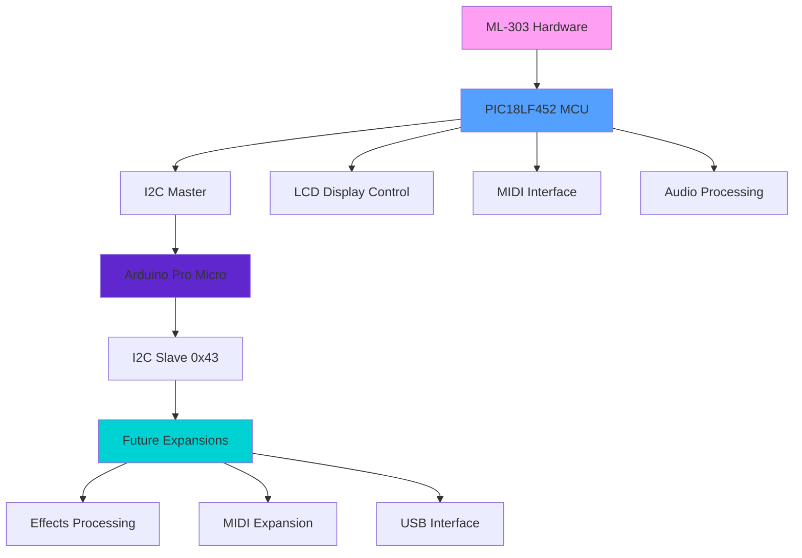
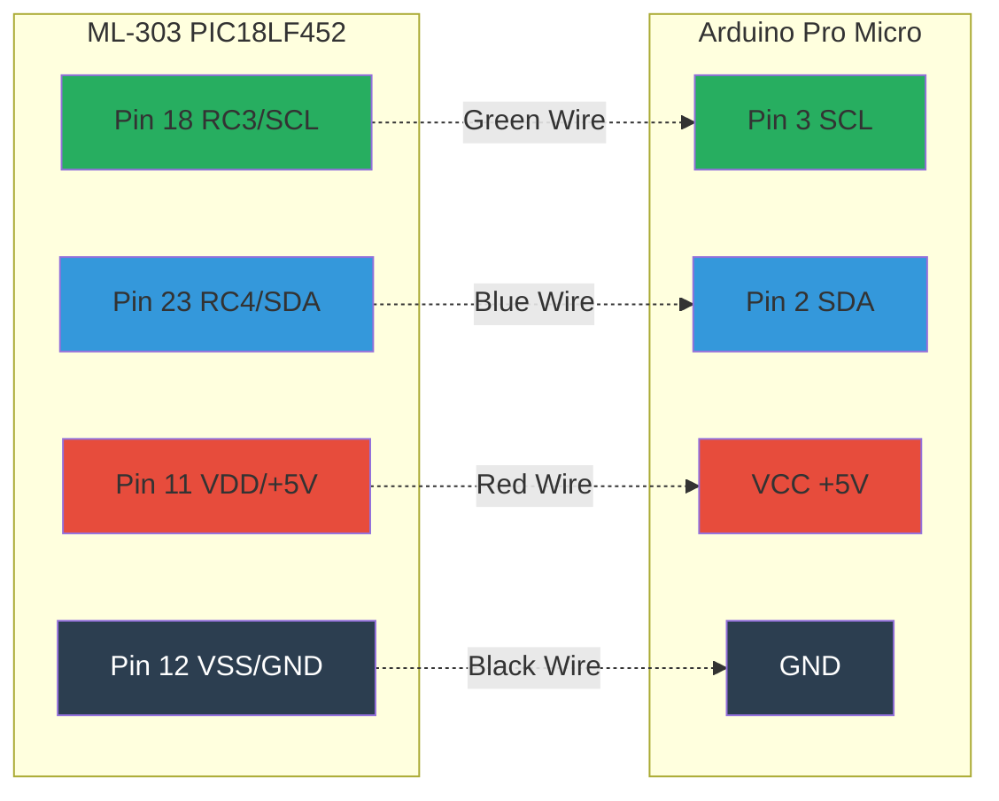
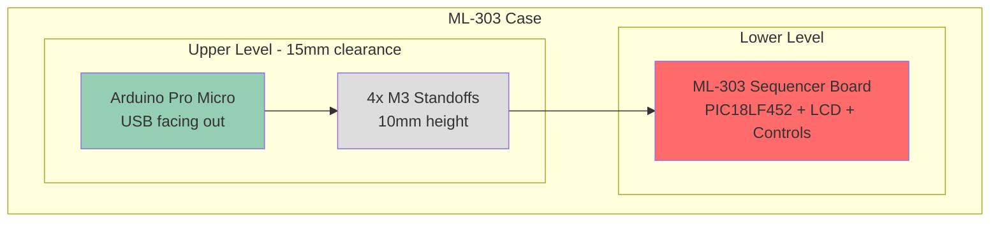
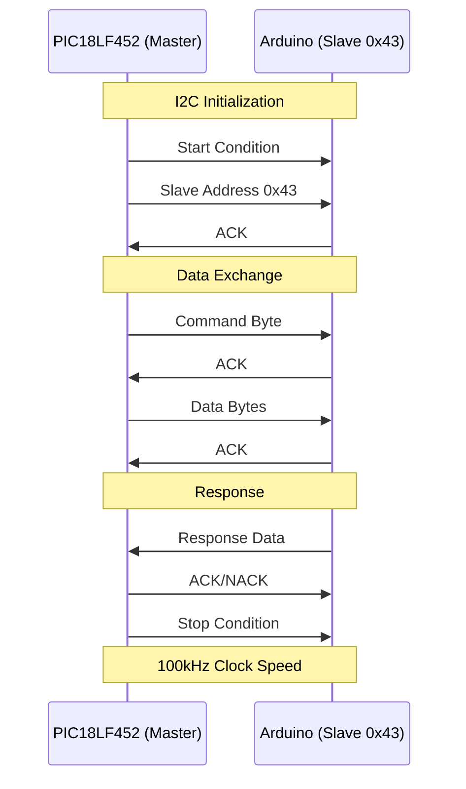
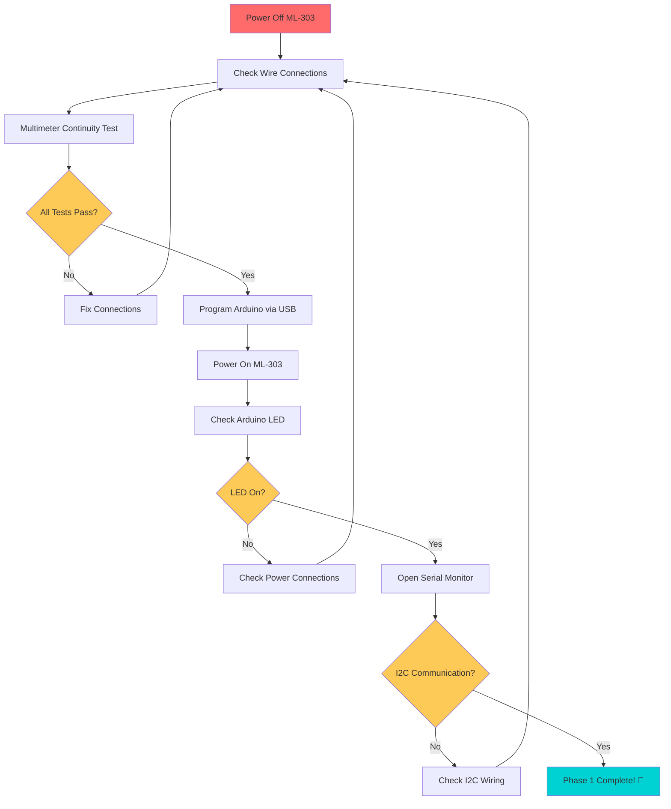

# ML-303 Arduino Integration - Mermaid Diagrams

## I2C Connection Flowchart

```mermaid
graph LR
    A[ML-303 Sequencer] --> B[PIC18LF452]
    B --> C{I2C Bus}
    C --> D[Arduino Pro Micro]
    
    B1[Pin 18 RC3/SCL] --> C1[SCL Clock Line]
    B2[Pin 23 RC4/SDA] --> C2[SDA Data Line]
    B3[Pin 11 VDD] --> C3[+5V Power]
    B4[Pin 12 VSS] --> C4[Ground]
    
    C1 --> D1[Pin 3 SCL]
    C2 --> D2[Pin 2 SDA]
    C3 --> D3[VCC]
    C4 --> D4[GND]
    
    style A fill:#ff6b6b
    style B fill:#4ecdc4
    style C fill:#45b7d1
    style D fill:#96ceb4
```

## System Architecture

```mermaid
graph TD
    A[ML-303 Hardware] --> B[PIC18LF452 MCU]
    B --> C[I2C Master]
    C --> D[Arduino Pro Micro]
    D --> E[I2C Slave 0x43]
    E --> F[Future Expansions]
    
    B --> G[LCD Display Control]
    B --> H[MIDI Interface]
    B --> I[Audio Processing]
    
    F --> J[Effects Processing]
    F --> K[MIDI Expansion]
    F --> L[USB Interface]
    
    style A fill:#ff9ff3
    style B fill:#54a0ff
    style D fill:#5f27cd
    style F fill:#00d2d3
```

## Pin Connection Map

```mermaid
graph LR
    subgraph ML303 [ML-303 PIC18LF452]
        P18[Pin 18 RC3/SCL]
        P23[Pin 23 RC4/SDA]
        P11[Pin 11 VDD/+5V]
        P12[Pin 12 VSS/GND]
    end
    
    subgraph Arduino [Arduino Pro Micro]
        A3[Pin 3 SCL]
        A2[Pin 2 SDA]
        AV[VCC +5V]
        AG[GND]
    end
    
    P18 -.->|Green Wire| A3
    P23 -.->|Blue Wire| A2
    P11 -.->|Red Wire| AV
    P12 -.->|Black Wire| AG
    
    style P18 fill:#27ae60
    style P23 fill:#3498db
    style P11 fill:#e74c3c
    style P12 fill:#2c3e50,color:#fff
    style A3 fill:#27ae60
    style A2 fill:#3498db
    style AV fill:#e74c3c
    style AG fill:#2c3e50,color:#fff
```

## Physical Layout

```mermaid
graph TB
    subgraph Case [ML-303 Case]
        subgraph Top [Upper Level - 15mm clearance]
            Arduino[Arduino Pro Micro<br/>USB facing out]
            Standoffs[4x M3 Standoffs<br/>10mm height]
        end
        
        subgraph Bottom [Lower Level]
            ML303[ML-303 Sequencer Board<br/>PIC18LF452 + LCD + Controls]
        end
        
        Arduino --> Standoffs
        Standoffs --> ML303
    end
    
    style Arduino fill:#96ceb4
    style ML303 fill:#ff6b6b
    style Standoffs fill:#ddd
```

## Communication Protocol

```mermaid
sequenceDiagram
    participant P as PIC18LF452 (Master)
    participant A as Arduino (Slave 0x43)
    
    Note over P,A: I2C Initialization
    P->>A: Start Condition
    P->>A: Slave Address 0x43
    A->>P: ACK
    
    Note over P,A: Data Exchange
    P->>A: Command Byte
    A->>P: ACK
    P->>A: Data Bytes
    A->>P: ACK
    
    Note over P,A: Response
    A->>P: Response Data
    P->>A: ACK/NACK
    P->>A: Stop Condition
    
    Note over P,A: 100kHz Clock Speed
```

## Testing Flow

```mermaid
flowchart TD
    A[Power Off ML-303] --> B[Check Wire Connections]
    B --> C[Multimeter Continuity Test]
    C --> D{All Tests Pass?}
    D -->|No| E[Fix Connections]
    E --> B
    D -->|Yes| F[Program Arduino via USB]
    F --> G[Power On ML-303]
    G --> H[Check Arduino LED]
    H --> I{LED On?}
    I -->|No| J[Check Power Connections]
    J --> B
    I -->|Yes| K[Open Serial Monitor]
    K --> L{I2C Communication?}
    L -->|No| M[Check I2C Wiring]
    M --> B
    L -->|Yes| N[Phase 1 Complete! 🎉]
    
    style A fill:#ff6b6b
    style N fill:#00d2d3
    style D fill:#feca57
    style I fill:#feca57
    style L fill:#feca57
```