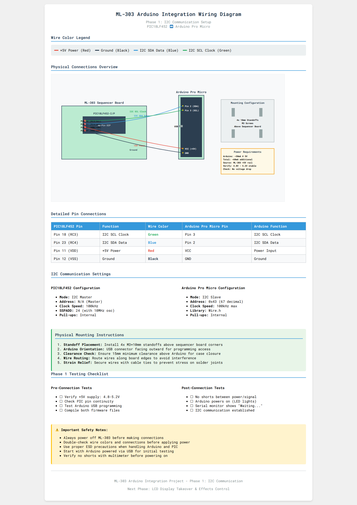

# ML-303 Arduino Integration Documentation

This directory contains the complete build documentation for integrating an Arduino with the ML-303 TB-303 clone.

## 📋 Documentation

### **`ML303_Arduino_Wiring_Diagram.png`** - Professional Wiring Diagram

This professional wiring diagram shows the complete ML-303 to Arduino Pro Micro connection with:
- **Wire color legend** (Red=+5V, Black=Ground, Blue=I2C SDA, Green=I2C SCL)
- **Physical connection overview** with exact pin mappings
- **Component specifications** and mounting instructions
- **Testing checklist** and I2C communication settings

### **`COMPLETE_BUILD_GUIDE.md`** - Complete Build Instructions

This comprehensive guide contains everything required for the ML-303 Arduino integration:

### **`MERMAID_DIAGRAMS.md`** - Visual Flowcharts & Diagrams

Interactive diagrams that GitHub renders natively, including:
- **Connection flowcharts** showing exact pin mappings
- **System architecture** with component relationships  
- **Testing workflow** with decision trees
- **Project phases** timeline and dependencies
- **Troubleshooting** decision trees
- **Power distribution** diagrams

#### 🛒 **Shopping List**
- Complete parts list with prices and part numbers
- Required vs optional components for each phase
- Where to buy components

#### 🔌 **Detailed Wiring Diagrams**
- Full PIC18LF452 40-pin pinout with exact pin numbers
- Arduino Pro Micro connection details
- Wire color coding and routing
- ML-303 board component locations

#### 🔧 **Step-by-Step Assembly**
- Detailed soldering instructions with tips
- Physical mounting with measurements
- Wire preparation and connection sequence
- Arduino programming code examples

#### 🧪 **Testing & Verification**
- Pre-power multimeter tests
- Voltage and continuity requirements
- I2C communication validation
- Success criteria for each phase

#### 🚨 **Troubleshooting**
- Common problems and solutions
- Diagnostic procedures
- Safety checks and warnings

## 🚀 Project Phases

### Phase 1: I2C Communication (Current)
- Arduino Pro Micro connected to PIC18LF452
- Basic communication protocol established
- Foundation for all future expansions

### Phase 2: LCD Display Takeover (Planned)
- Custom display messages
- Real-time parameter monitoring
- Enhanced user interface

### Phase 3: Effects Processing (Planned)
- Digital audio effects
- Real-time parameter control
- MIDI-controlled effects

### Phase 4: MIDI Expansion (Planned)
- Enhanced MIDI functionality
- USB MIDI interface
- MIDI effects routing

## 💡 Key Features

### ✅ **Verified Pin Assignments**
All pin assignments have been verified to eliminate conflicts:
- **Power**: PIC Pin 11/12 → Arduino VCC/GND
- **I2C**: PIC Pin 18/23 → Arduino Pin 3/2 (SCL/SDA)
- **Address**: Arduino I2C slave at 0x43

### ⚡ **Non-Invasive Design**
- No modifications to original ML-303 circuits
- Completely reversible installation
- ML-303 functions normally if Arduino removed

### 🔒 **Safety First**
- Detailed safety warnings and precautions
- Step-by-step testing procedures
- Protection against reverse polarity damage

## 📖 How to Use This Documentation

1. **Start with** `COMPLETE_BUILD_GUIDE.md` - it contains everything you need
2. **Follow the phases** - Phase 1 establishes the foundation
3. **Test thoroughly** - each phase has verification steps
4. **Ask questions** - document any issues for future improvements

## ⚠️ Important Safety Notes

- **ML-303 has NO reverse polarity protection** - double-check all connections
- **Always power off** before making any connections
- **Use multimeter** to verify all connections before applying power
- **Start with USB power** to test Arduino before connecting to ML-303

---

*This project extends the ML-303's capabilities while preserving its original analog character and functionality.*