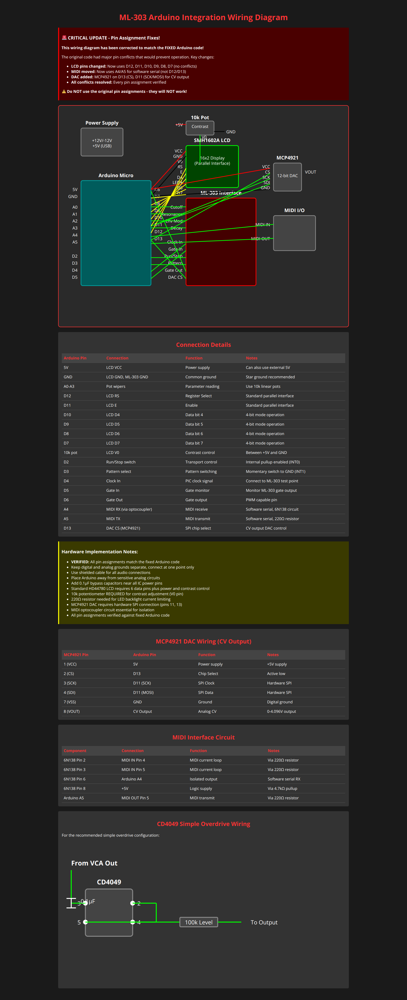

# ML-303 Arduino Integration Documentation

This directory contains everything you need to add Arduino control to your ML-303 TB-303 clone.

## 🚀 Start Here

### **`QUICK_START.md`** ⭐ - Begin Your Build

**New to this project? Start here!** This guide gets you up and running in 3 simple steps:
1. **Get the Parts** (15 min) - Simple shopping list
2. **Make Connections** (30 min) - 4 color-coded wires  
3. **Test It Works** (10 min) - Verify everything works

## 📋 Complete Documentation

### **`ML303_Arduino_Wiring_Diagram.png`** - Professional Wiring Diagram

This professional wiring diagram shows the complete ML-303 to Arduino Pro Micro connection with:
- **Wire color legend** (Red=+5V, Black=Ground, Blue=I2C SDA, Green=I2C SCL)
- **Physical connection overview** with exact pin mappings
- **Component specifications** and mounting instructions
- **Testing checklist** and I2C communication settings

### **`Additional_Wiring_Diagram.png`** - Comprehensive System Diagram

This comprehensive diagram shows the complete ML-303 Arduino integration including:
- **LCD Display Interface** - Complete pin assignments and connections
- **MCP4921 DAC Wiring** - 12-bit DAC for CV output control
- **MIDI Interface Circuit** - MIDI I/O integration points
- **CD4049 Overdrive Wiring** - Simple overdrive circuit implementation
- **Power Supply Distribution** - +12V/+5V power routing
- **Connection Details Table** - Complete pin reference for all components

### **`COMPLETE_BUILD_GUIDE.md`** - Detailed Instructions

For experienced builders who want comprehensive details:
- Complete parts list with part numbers and prices
- Detailed step-by-step assembly with photos
- Troubleshooting guide and safety procedures
- Technical specifications and testing procedures

### **`MERMAID_DIAGRAMS.md`** - Interactive Flowcharts

GitHub-rendered diagrams for visual learners:
- Connection flowcharts with exact pin mappings
- System architecture and component relationships  
- Testing workflow and troubleshooting decision trees

## 🎯 What You'll Accomplish

**Phase 1 Goal**: Establish I2C communication between ML-303's PIC microcontroller and Arduino Pro Micro

**Success Criteria**:
- Arduino powers on when ML-303 is powered
- Serial monitor shows "Waiting for commands from PIC..."
- ML-303 operates exactly as before (no interference)
- Foundation ready for future expansions (LCD control, effects, MIDI)

## ⚠️ Safety Reminders

- **ML-303 has NO reverse polarity protection** - double-check wire colors
- **Always power off** before making connections
- **Test with multimeter** before applying power

---

*This project extends the ML-303's capabilities while preserving its original analog character and functionality.*